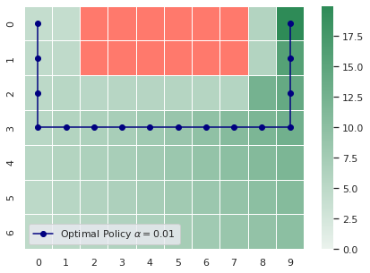

# Risk-Averse Distributional Reinforcement Learning

This is a fork from [this repository](https://github.com/Silvicek/cvar-algorithms) that contains an implementation of CVaR Policy Iteration (Chow. et. al. 2015) that was used in some figures the paper. The figure displays the CVaR(0.01) optimal path from the starting point (upper-left corner) to the goal (upper right corner) in an environment with probability of random action p=0.05. Other figures are in ./figures and source result files are in ./cvar/gridworld/results.

## Installation

Install tensorflow by following instructions in https://www.tensorflow.org/install/
Using GPU during training is highly recommended (but not required)

    pip3 install tensorflow-gpu

Install the cvar package (from ./cvar-algorithms directory)

    pip3 install -e .

### CVaR Value Iteration

The fork aims to run on a LavaGridworld of 10x7 tiles with probability of random action p (either 0.1 or 0.05 in the figures).

For CVaR Value Iteration run (from ./cvar-algorithms/cvar/gridworld directory)

    python3 run_vi.py

